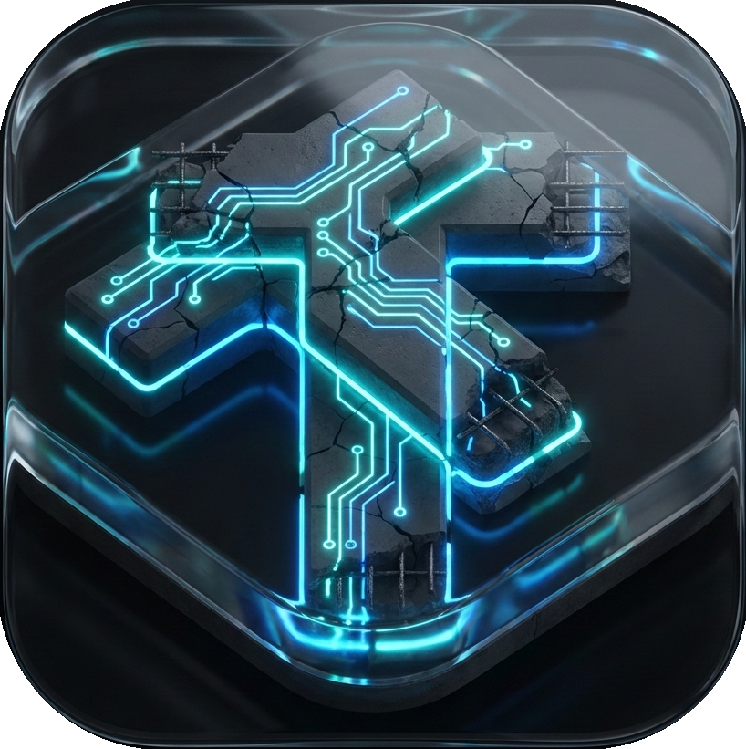

<div align="center">

  

  # T E N S O R C R E T E
  ### ULTIMATE EDITION v5.3

  **The Future of Autonomous Structural Intelligence**

  [](https://python.org)
  [](https://tensorflow.org)
  [](https://qt.io)
  [](LICENSE)
  [](https://microsoft.com)

  [Download Latest Release](https://github.com/MustafijRatul/tensorcrete/releases/latest) • [Report Bug](https://github.com/MustafijRatul/tensorcrete/issues) • [Request Feature](https://github.com/MustafijRatul/tensorcrete/issues)

</div>

---

## ⚡ Overview

**TensorCrete** is not just a detection tool; it is an **enterprise-grade structural analysis engine**. Built for civil engineers and drone surveyors, it leverages state-of-the-art Convolutional Neural Networks (CNN) to detect concrete defects with surgical precision.

Whether you are inspecting a single pillar or processing a **drone swarm feed** of 5,000 bridge images, TensorCrete delivers actionable intelligence in a stunning, GPU-accelerated **Glassmorphism** interface.

---

## 🚀 Key Capabilities

### 👁️ Thermal X-Ray Vision
> **"See what the naked eye misses."**
> Our advanced OpenCV pipeline applies a pseudo-thermal heatmap to structural cracks, visualizing stress points and calculating pixel-perfect width estimates instantly.

### 🛸 Drone Swarm Batch Processor
> **"Analyze miles of infrastructure in minutes."**
> Drag and drop an entire folder of drone survey imagery. TensorCrete's multi-threaded engine processes the queue in the background, generating a live "Mission Log" and statistical breakdown of safe vs. critical structures.

### 💎 Next-Gen Glass UI
> **"Focus where it matters."**
> A fully immersive, semi-transparent acrylic interface (Windows DWM API) that blends seamlessly with your desktop. Features neon accents, smooth animations, and a unified command dashboard.

### 📄 Automated Engineering Reports
> **"Paperwork, solved."**
> Generate ISO-standard PDF engineering reports with a single click. Includes:
> *   High-res defect imagery with X-Ray overlays.
> *   GPS Coordinates extraction (EXIF).
> *   AI Confidence scores and Severity classification.

---

## 🛠️ The Technology Stack

TensorCrete is forged from the most robust libraries in the Python ecosystem:

| Component | Technology | Description |
| :--- | :--- | :--- |
| **Neural Core** | **TensorFlow / Keras** | Custom trained CNN model for concrete surface analysis. |
| **Visual Engine** | **OpenCV** | Image pre-processing, contour detection, and heatmap generation. |
| **Interface** | **PySide6 (Qt)** | Hardware-accelerated UI with custom `paintEvent` rendering. |
| **Reporting** | **ReportLab** | Programmatic PDF generation with vector graphics. |
| **System** | **Win32 API** | Direct DWM calls for Acrylic/Blur window effects. |

---

## 📸 Screenshots

> *Add your screenshots here. Drag and drop images into the GitHub readme editor to generate URLs.*

<div align="center">
  <table>
    <tr>
      <td align="center"><b>Unified Command Dashboard</b></td>
      <td align="center"><b>Drone Batch Processor</b></td>
    </tr>
    <tr>
      <td></td>
      <td></td>
    </tr>
  </table>
</div>

---

## 📥 Installation

### Option A: The Installer (Recommended)
Download the pre-compiled, professional installer from the **[Releases Page](https://github.com/MustafijRatul/tensorcrete/releases/latest)**.
*   *Includes auto-updates, desktop shortcuts, and uninstaller.*

### Option B: Run from Source
If you are a developer, you can run the core engine locally:

```bash
# 1. Clone the repository
git clone https://github.com/MustafijRatul/tensorcrete.git

# 2. Navigate to directory
cd tensorcrete

# 3. Install dependencies (Requires Python 3.10+)
pip install tensorflow opencv-python reportlab pillow pyside6 qtawesome

# 4. Launch the Neural Core
python app.py
```

---

## 🔮 Roadmap

- [x] **v5.3:** Persistent History & Settings (JSON)
- [x] **v5.3:** Glass/Acrylic UI Restoration
- [ ] **v6.0:** Real-time Video Stream Analysis (RTSP)
- [ ] **v6.5:** 3D Point Cloud Crack Mapping
- [ ] **v7.0:** Cloud Sync & Team Collaboration

---

## 👤 Author

**Md. Mustafijur Rahman Ratul**  
*AI Research Enthusiast*

<a href="https://github.com/MustafijRatul/">
  
</a>
<a href="https://www.linkedin.com/in/md-mustafijur-rahman-ratul/">
  
</a>
<a href="https://www.researchgate.net/profile/Md-Mustafijur-Rahman-Ratul?ev=hdr_xprf">
  
</a>

---

<div align="center">
  <sub>Thank you for visiting this page</sub>
</div>
